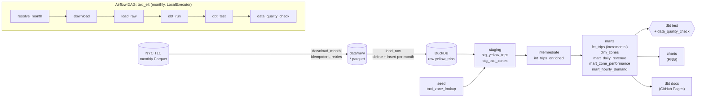
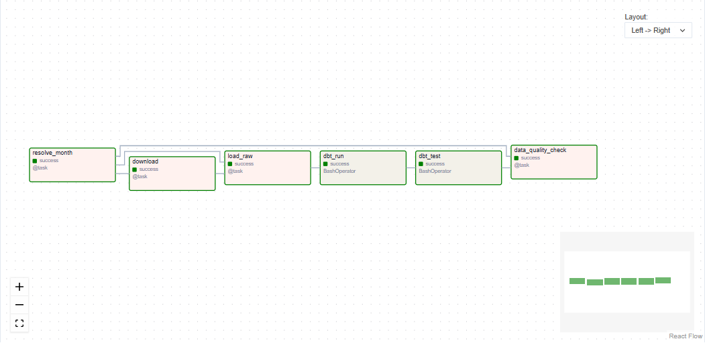
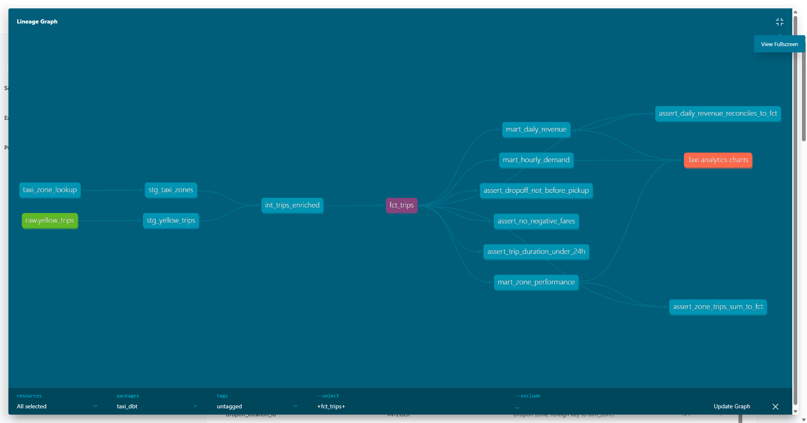
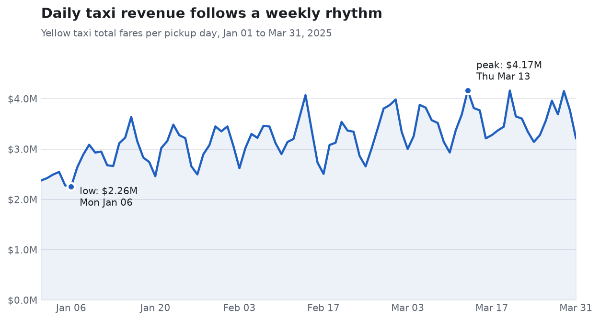
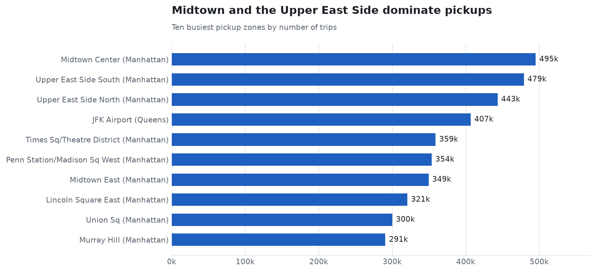
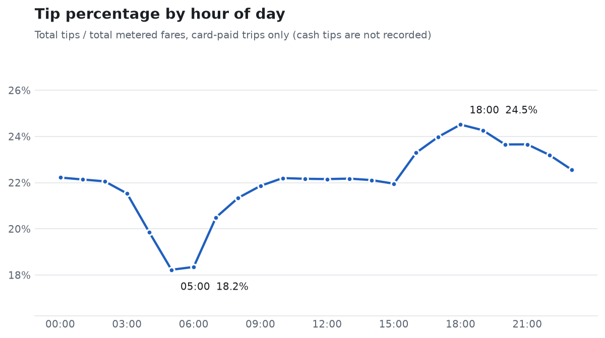
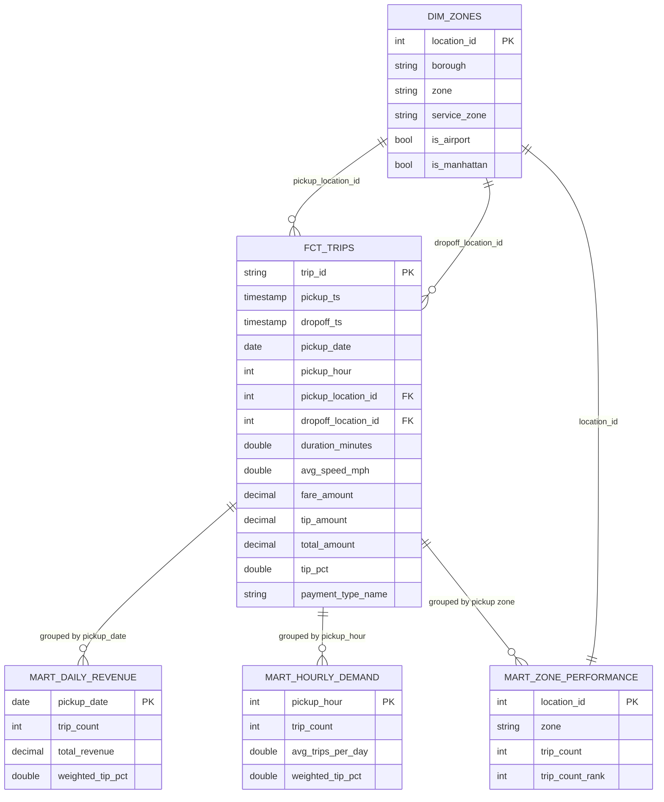

# NYC Taxi Analytics Pipeline

[](https://github.com/MayukhRaj007/nyc-taxi-analytics-pipeline/actions/workflows/ci.yml)
[](https://MayukhRaj007.github.io/nyc-taxi-analytics-pipeline/)

An orchestrated **ELT pipeline**: Apache Airflow downloads public NYC TLC yellow-taxi trip data, loads it into
**DuckDB**, and **dbt** turns it into tested analytics tables. Everything is free and local: one `docker compose up`,
no cloud accounts.

## Problem statement

NYC publishes every taxi trip as monthly Parquet files. The raw data is large (3-4 million rows a month) and messy:
about 5% of trips have refunds (negative fares), impossible durations, absurd meter values (a $863,372 fare, a
320,000-mile trip) or timestamps outside the month of their file. Analysts should not each have to rediscover that.

This project answers: *how do you turn a messy monthly public feed into trustworthy, documented, tested tables, on a
schedule, safely re-runnable, on a laptop?*

## Architecture



| Layer | Tool | Notes |
|---|---|---|
| Orchestration | Apache Airflow 2.10 (LocalExecutor) + Postgres 16 metadata DB | TaskFlow API for Python steps, `BashOperator` for dbt |
| Warehouse | DuckDB 1.1 (single file on a mounted volume) | No server to run |
| Transformation | dbt-core 1.10 + dbt-duckdb, `dbt_utils`, `dbt_expectations` | Runs in its own virtualenv inside the Airflow image |
| Quality | dbt tests, a Python quality-check task, pytest | |
| CI/CD | GitHub Actions: ruff, sqlfluff, pytest, `dbt build` on a sample; dbt docs to GitHub Pages | |

## Run it in 3 commands

Requirements: Docker Desktop (WSL2 backend on Windows) with about 6 GB of memory available to Docker. Nothing else.

```bash
git clone https://github.com/MayukhRaj007/nyc-taxi-analytics-pipeline.git && cd nyc-taxi-analytics-pipeline
docker compose up -d --build        # or: make up
# open http://localhost:8080  (login admin / admin, local-only credentials)
```

The DAG is unpaused on start, so Airflow immediately **catches up Jan, Feb and Mar 2025** (about 90 seconds per month
on my machine, one month at a time). Then:

```bash
make trigger-dag MONTH=2025-02   # rerun a month (idempotent)
make dbt-build                   # dbt deps + build against the warehouse
make dbt-docs                    # dbt docs at http://localhost:8081
make charts                      # re-render the PNGs below
make test lint                   # pytest, ruff, sqlfluff
make down                        # stop all containers when you are done
```

No `make` on Windows? Every target is a plain `docker compose ...` line in the [Makefile](Makefile); copy it, or run
`make` from WSL2.

> **One writer at a time.** DuckDB allows a single writing process, so don't run `make dbt-build` while a DAG run is
> in progress. The DAG itself is configured with `max_active_runs=1` for the same reason.

### Screenshots

| Airflow graph view | dbt lineage graph |
|---|---|
|  |  |
| `taxi_elt`: all 6 tasks succeeded for the Feb 2025 run | `fct_trips` lineage from `raw.yellow_trips` through staging and intermediate to the marts, with the singular tests and the charts exposure |

## Results

All numbers below come from a real run of the pipeline on Jan to Mar 2025 yellow-taxi data.

| | |
|---|---|
| Raw rows loaded (`raw.yellow_trips`) | **11,198,026** (3,475,226 + 3,577,543 + 4,145,257) |
| Rows in `fct_trips` after cleaning | **10,660,590** (about 95.2% kept; 94.9-95.8% per month) |
| Total revenue (`total_amount`, excludes cash tips) | **$289.9M** over 90 days |
| dbt `build` | 8 models, 1 seed, 1 snapshot, **52 data tests**, all passing |
| pytest | **31 tests**, all passing |
| Airflow catchup | 3 of 3 runs succeeded, 6 of 6 tasks each |



Revenue peaked on Thu 13 Mar 2025 at $4.17M; the lowest day was Mon 6 Jan at $2.26M.



Midtown Center (495k trips), Upper East Side South (479k) and Upper East Side North (443k) lead; JFK Airport (407k) is
the only non-Manhattan zone in the top ten.



Tips are lowest around 05:00 (18.2%) and highest at 18:00 (24.5%). The measure is total tips divided by total fares on
card-paid trips only, because the meter does not record cash tips.

## Data model



| Layer | Model | Materialisation | Purpose |
|---|---|---|---|
| source | `raw.yellow_trips` | table (written by Airflow, not dbt) | Faithful copy of the TLC feed plus `source_month`, `loaded_at` |
| seed | `taxi_zone_lookup` | table | 265 TLC zones |
| staging | `stg_yellow_trips` | view | Rename, cast, drop invalid rows |
| staging | `stg_taxi_zones` | view | Cleaned zone lookup |
| intermediate | `int_trips_enriched` | view | Zone names, duration, speed, tip % |
| marts | `fct_trips` | **incremental** (`unique_key=trip_id`) | One row per trip |
| marts | `dim_zones` | table | Zone dimension with airport / Manhattan flags |
| marts | `mart_daily_revenue`, `mart_zone_performance`, `mart_hourly_demand` | table | Analytics aggregates |
| snapshot | `snap_taxi_zones` | SCD2 | History of zone changes |

The dbt project has descriptions on every model and column, an [exposure](taxi_dbt/models/marts/_exposures.yml) for
the charts, and a lineage graph in the generated docs.

**Tests:** `not_null`, `unique`, `accepted_values`, `relationships`, `dbt_utils.accepted_range`,
`dbt_expectations` (value ranges, row counts), and five singular tests in [`taxi_dbt/tests`](taxi_dbt/tests): no
negative fares, trip duration under 24h, dropoff not before pickup, daily revenue reconciles to the fact table, and zone
totals add up to the fact table. **Macros:** `safe_divide`, `payment_type_name`, `weighted_tip_pct`,
`generate_schema_name`.

## Design decisions

**Why ELT, not ETL.** The raw Parquet is loaded into DuckDB *untouched* (`raw.yellow_trips`), and all cleaning and
business logic lives in version-controlled SQL (dbt). That keeps an auditable copy of what TLC published, makes every
rule visible and testable, and means a changed rule is a re-run instead of a re-download. DuckDB makes the load almost
free (a month loads in 2 to 4 seconds).

**Why incremental `fct_trips`.** Each run adds one month (about 3.5M rows). An incremental model with
`unique_key=trip_id` (`delete+insert`) only rebuilds the month being processed instead of every month ever loaded. The
Airflow DAG passes the month as `start_date`/`end_date` vars, so a backfill or rerun of *any* month, in any order,
rebuilds exactly that month. Without those vars it falls back to "last 3 days of existing data plus newer".

**Idempotency, end to end.** Every step can be retried or rerun and converge to the same state:
- `download`: skipped if the file exists; writes to a `.part` file and renames on success, so a crash never leaves a
  truncated "present" file.
- `load_raw`: deletes the month's rows and inserts the new ones **in one transaction**, so a retry never double-counts
  and a failed insert rolls back instead of leaving the month empty.
- `fct_trips`: `delete+insert` on `trip_id` for the month's window.

*Proof (real run):* after `airflow dags backfill` re-ran February, `raw.yellow_trips` still had 3,577,543 February rows
and `fct_trips` 3,394,229; the download task logged "already present, skipping" and the load logged "replaced
3577543 old rows with 3577543 new rows".

**Cleaning is explicit and measured.** Staging drops (never "fixes") negative fares/totals/tips, dropoff before pickup,
trips of 24h or more, fares over $1,000 or distances over 200 miles, and rows dated outside their file's month. The
`data_quality_check` task reports how many rows survived (about 95% per month) and fails the run below 85%.

**Tip % is computed on card trips only.** The meter records tips for card payments only; including cash trips would
show 0% tips and bias the average down. I also publish `weighted_tip_pct` (total tips / total fares), because the plain
average of per-trip percentages is inflated by tiny fares (26.7% vs 22.7% overall in this data).

**Other choices**
- *dbt in its own virtualenv* inside the Airflow image, so dbt's pins never conflict with Airflow's constraints.
- *BashOperator for dbt* rather than a dbt-Airflow integration: simplest thing that works, same commands locally, in CI and
  in the DAG. `dbt_run` and `dbt_test` are separate tasks so a test failure is its own red box.
- *DuckDB temp spill on container-local disk* (`/tmp`), because DuckDB could not spill reliably onto the Windows/OneDrive
  bind mount that holds the warehouse file.
- *Task logs and Postgres data in named Docker volumes*, so cloud-synced folders aren't churned.
- *Monthly catchup bounded by `start_date`/`end_date`* to get exactly three runs.

## Limitations and gotchas (found while building)

- **Re-running a month:** use `make trigger-dag MONTH=2025-02` (a backfill). The UI "Trigger DAG" button stamps the
  run with today's date, which is after the DAG's `end_date`, and Airflow then finishes it instantly with no tasks.
- **Single writer:** see the note above; DuckDB is not a concurrent multi-user warehouse.
- **dbt-core 1.10** is flagged as deprecated by dbt (newer versions exist). I stayed on it because it works with
  Airflow's pinned DuckDB 1.1.3; upgrading means bumping DuckDB in both environments.
- **CI uses a 3,000-row sample** (`sample_data/`, a reproducible random sample of real January trips) so it stays fast;
  it does not exercise the full 11M-row volume.
- **The zone snapshot is a demo.** TLC zones almost never change, so `snap_taxi_zones` will normally hold one version
  per zone.
- Airflow admin credentials (`admin`/`admin`) are local-development defaults. Don't expose port 8080.

## Repository layout

```
airflow/            Dockerfile, requirements, DAG (dags/taxi_elt.py) and library (dags/taxi_lib/)
taxi_dbt/           dbt project: models, seeds, snapshots, macros, singular tests
scripts/            make_charts.py, make_sample.py, load_sample.py
tests/              pytest suite (loader, downloader, quality checks, DAG structure)
sample_data/        3,000-row sample used by CI
docs/images/        Charts (and your screenshots)
.github/workflows/  ci.yml, docs.yml
```

## Publishing the dbt docs (GitHub Pages)

1. Push to GitHub, then **Settings > Pages > Source: GitHub Actions**.
2. Pushes to `main` that touch `taxi_dbt/` run `docs.yml`, which builds the project on the sample data, runs
   `dbt docs generate` and deploys `index.html`, `manifest.json` and `catalog.json`.
3. The repo URLs in this README and in `taxi_dbt/models/marts/_exposures.yml` already point at this repository.

## What I would do next

- Add **dbt source freshness** and **elementary**-style anomaly tests on daily volume and revenue.
- Move the warehouse to **MotherDuck or Postgres/BigQuery** to lift the single-writer limit, keeping the dbt models.
- Add more TLC datasets (green, FHV, **FHVHV**) behind one parameterised DAG using dynamic task mapping.
- Load via **DuckDB's `httpfs`** straight from the TLC URL to skip the intermediate files.
- Send failure alerts (Slack/email) from the existing `on_failure_callback` hook.
- Add a **dbt exposure dashboard** (Evidence, Metabase or Superset) instead of static PNGs.
- Pre-commit hooks for ruff and sqlfluff, and pin dbt/Airflow upgrades with Renovate.

## License

[MIT](LICENSE)
